# ytmeta

CLI tool and web app for viewing YouTube video metadata. Terminal output uses Rich; the web version has a dark UI.

<p align="center">
  
</p>

## Status

Working: the CLI and the web app both run and fetch real metadata. Not published to
PyPI — installing from a clone is the only method.

You can also run without installing, given `yt-dlp`, `rich`, and `flask` on the path:

```bash
python3 -m ytmeta.cli <youtube-url>
```

## CLI

```bash
pip install -e .
ytmeta <youtube-url>
```

### Options

| Flag | Description |
|------|-------------|
| `-j, --json` | Output raw JSON |
| `--stats-only` | Views, likes, comments only |
| `--tags-only` | Tags only |
| `--chapters-only` | Chapters only |
| `--no-subtitles` | Hide subtitles panel |
| `--no-formats` | Hide formats table |
| `--no-description` | Hide description |

## Web

```bash
pip install -e .
python web/server.py
```

Open http://localhost:5050 in your browser.

## Limitations

- The terminal and web versions do not show identical metadata. The CLI truncates the
  description to 20 lines and lists at most 10 auto-caption languages before collapsing
  the rest; the web UI shows the description in full but lists auto-captions only as a
  count, and shows subtitle languages without their formats.
- Est. Watch Hours appears in the Technical Details panel in the CLI and in the
  Statistics panel in the web UI.
- `--stats-only` prints exact comma-grouped counts; the default view abbreviates to K/M.

## Dependencies

- [yt-dlp](https://github.com/yt-dlp/yt-dlp)
- [rich](https://github.com/Textualize/rich)
- [flask](https://flask.palletsprojects.com/)
